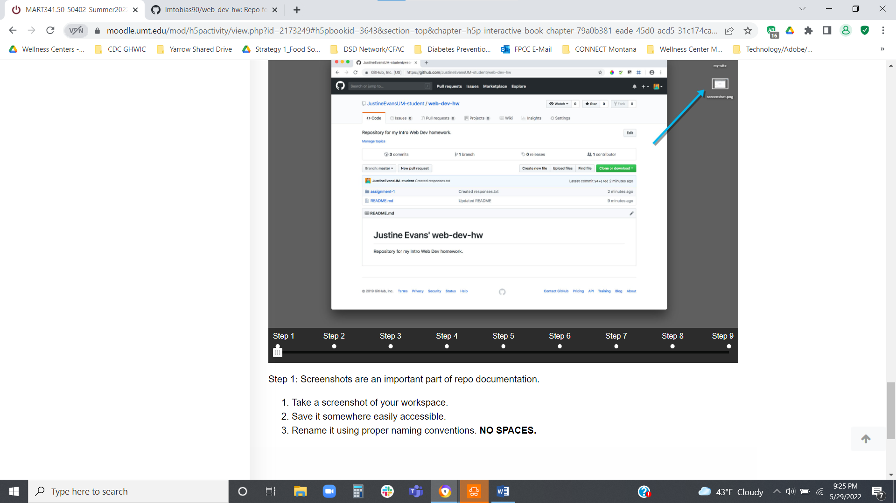

# Assignment-2
## Lauren Tobias
### Intro to Web Dev HW

Paragraph testing while watching tutorial on Assignment 2.

List:
- List item
- List item 2

Links! square brackets to describe, parenthesis to link.  Image link needs a ! before the square brackets

[Descriptive Text for website such as, Google Search](https://www.google.com)

[My Responses](./responses.txt)

